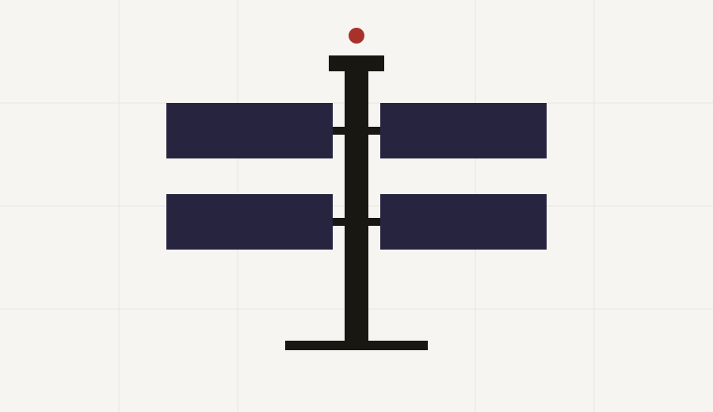
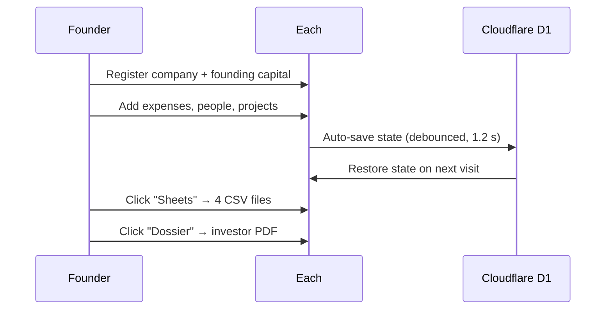
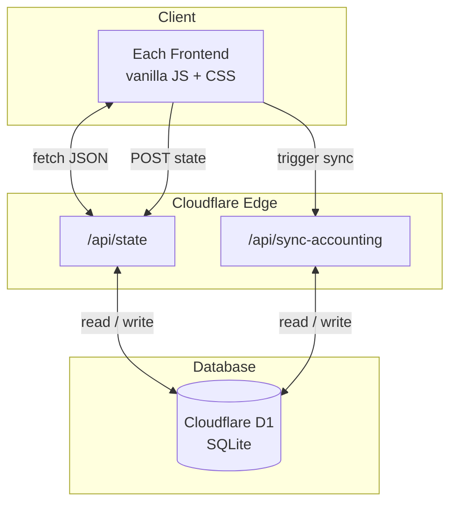
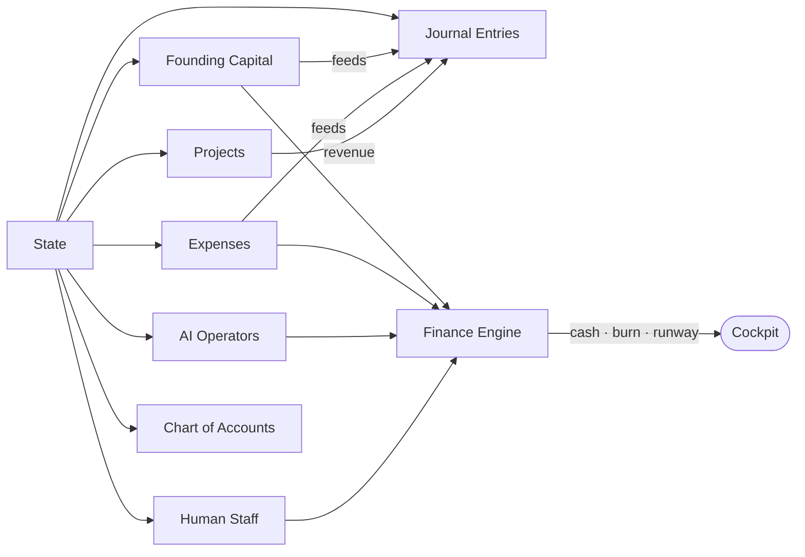

# Each

> **ERP · ACT · CRM · HR for the startup.**  
> One spine. Four pillars. Nothing else.

[](https://axiom.nonarkara.org)

[](https://each.nonarkara.org)
[](#architecture)
[](#files)
[](./LICENSE)

<p align="center">
  
</p>

---

## What is Each

Most business software is a frankenstein of foreign runtimes, bloated modules, and features you will never use. Founders do not need a dashboard for dashboards. They need to know three things: **cash, people, and what is shipping**. Everything else is noise.

**Each** (EACH = ERP, ACT, CRM, HR) strips it down:

- **One spine.** The cockpit, routing, and data layer are shared by every pillar.
- **Four pillars.** Finances, People, Projects, Accounting. No more, no less.
- **One bold move per surface.** Runway is the hero number. The rest is context.
- **No framework fatigue.** Vanilla JS and CSS. No build step in the way of reading the code.

If you are tired of stitching EspoCRM, ERPNext, Frappe HR, and a separate accounting app together, Each is the opposite direction: a single, opinionated workspace that a solo founder can actually run.

---

## Design philosophy

Each is built on the [Axiom Design Core](https://github.com/Nonarkara/Axiom-Design-Core) — a discipline that treats commercial software the same way a modern architect treats a building: every element must be load-bearing, every surface must communicate, and nothing exists without purpose.

### Structure like architecture

Finance is structure. A startup is a building under construction: the foundation is capital, the walls are people and projects, and the roof is revenue. Each renders this structure explicitly:

- **Founding capital** = the foundation you pour before you build.
- **Expenses** = the materials and labor you buy to keep construction moving.
- **Revenue** = the floors you finish and sell or lease.
- **Runway** = how many months the building can stand before it needs the next payment.

The architecture is honest. There are no hidden columns. The balance sheet and P&L are not magic — they are the same structure, viewed from two angles.

### Selling like a human

Sales is not a pipeline stage. It is a relationship. Each's CRM pillar is built from psychology and anthropology: people buy from people they trust, and trust is earned through consistent follow-through.

- Projects live on a Kanban because status is easier to read than lists.
- AI reads surface the next human action, not vanity metrics.
- The investor dossier tells a story with numbers, because investors, like customers, decide with narrative first and math second.

### Calculation like communication design

A great spreadsheet is a bad interface. A great interface reveals the calculation without showing the formula. Each uses communication design principles — hierarchy, contrast, grouping, and white space — so the founder sees the answer before reading the label.

- Runway is the largest number on the screen.
- Red appears only when something is genuinely at risk.
- Tables are dense, but never crowded.
- Every label is small, uppercase, and spaced — so the numbers do the talking.

### Digital like a game

Finance should feel like a LEGO set, not a tax audit. Each turns business into a game of blocks:

- **Projects** are the models you want to build.
- **Resources** are the blocks you need.
- **Expenses** are the blocks you buy.
- **Income** is the blocks that come back when someone wants what you built.
- **Cash** is the blocks currently in your hand.
- **Credit** is borrowing blocks now and promising to return them later — with interest.

You lose when you have no blocks left to keep building. You win when each finished model funds the next one.

Some blocks are **CapEx** — durable assets and helpers that keep building future models. Some blocks are **OpEx** — the glue, rent, and daily fuel that keep the workshop open. Each tracks both, because confusing them is how founders run out of blocks.

**Credit** is borrowing blocks now and promising to return them later — with interest. Each's **Credit & installments** section lets you record loans, see total debt, and watch the monthly installment reduce your runway in real time. This is the payback schedule made visible.

### Behavioral economics in practice

Each is designed to reduce the friction that kills startups:

- **Auto-save** removes the forgetting tax.
- **Demo mode** lowers the activation energy on first visit.
- **CSV export** removes the fear of lock-in.
- **The red runway number** creates loss aversion at the right moment.
- **One-click accounting sync** turns bookkeeping from a chore into a reward.

### Convenience because finance should be fun

If finance feels like punishment, founders avoid it. Each makes it convenient enough to check every morning. The cockpit loads instantly. The data model is one JSON blob. The mental model is one game.

---

## Made by Axiom

Each is a product of [Axiom](https://axiom.nonarkara.org) — an innovation consultancy that builds tools for founders and growing teams. Axiom's philosophy: the best tool is the one that disappears into the work.

The visual and interaction system is governed by the [Axiom Design Core](https://github.com/Nonarkara/Axiom-Design-Core).

---

## The four pillars

| Pillar | Discipline | What it gives you |
|---|---|---|
| **Finances** | ERP | Cash, burn, runway, CapEx/OpEx split, revenue pipeline, loans & installments, transparent ledger |
| **People** | HR | AI operators + human staff, both treated as monthly OpEx |
| **Projects** | CRM | Kanban, checklists, notes, deal status, AI reads on outstanding revenue |
| **Accounting** | Books | Chart of accounts, double-entry journal, balance sheet, P&L |

The investor dossier is the fifth surface — not a pillar, but the **export**. One page, one print button.

---

## How it works



---

## Architecture



- **Frontend:** Cloudflare Pages serves static HTML/CSS/JS. No bundler. No transpiler.
- **Backend:** Cloudflare Pages Functions handle `/api/state` and `/api/sync-accounting`.
- **Database:** Cloudflare D1 stores one `workspace_state` row per company.
- **Offline fallback:** Falls back to `localStorage` when offline or served from `file://`.
- **Security:** Add Cloudflare Access on `each.nonarkara.org` for zero-code auth, or set an `API_KEY` secret for token-level protection.

---

## Data model



All state lives in one JSON blob. The finance engine derives every number from first principles on each render — no cached intermediates.

---

## Google Sheets export

Click **Sheets** in the top bar. Four CSV files download instantly:

| File | Contents |
|---|---|
| `{company}-finances.csv` | All expenses: date, vendor, category, CapEx/OpEx, amount |
| `{company}-people.csv` | AI operators + human staff with monthly costs and efficiency |
| `{company}-projects.csv` | All projects: status, deal type, value, tasks progress |
| `{company}-journal.csv` | Full double-entry journal: account, debit, credit, entry type |

Open any CSV in Google Sheets with **File → Import → Upload**. No API key. No OAuth. No setup. Just data.

---

## Quick start

```bash
git clone https://github.com/Nonarkara/each.git
cd each
npm install
npm run dev          # http://localhost:8788
```

No bundler. No transpiler. The dev server is Wrangler with a local D1 binding.

**Demo:** enter registration number **`0105566000000`** on the first screen → Each autofills the company → scan paperwork → founding capital lands → connect Gmail → receipts become expenses.

For day-to-day use, read [`MANUAL.md`](./MANUAL.md).

---

## Deploy your own

You need a Cloudflare account.

```bash
npx wrangler login
npm run db:create         # creates the D1 database
npm run db:migrate        # runs migrations (workspace_state table)
npm run deploy            # first deploy to Cloudflare Pages
```

### Custom domain

After the first deploy, add your domain in the Cloudflare dashboard:

1. **Workers & Pages → each → Custom domains → Add domain** → enter `each.nonarkara.org`.
2. **DNS → Add record**:
   - Type: `CNAME`
   - Name: `each`
   - Target: `each-c3p.pages.dev` (your Pages subdomain)
   - Proxy status: enabled (orange cloud)

Cloudflare will verify the CNAME and issue SSL. Status changes from `Pending` to `Active` within a few minutes.

### Continuous deployment (GitHub Actions)

A workflow is included at `.github/workflows/deploy.yml`. Deploys on every push to `main`. Add two secrets to your GitHub repo under **Settings → Secrets → Actions**:

```
CLOUDFLARE_API_TOKEN    # Cloudflare → My Profile → API Tokens → Cloudflare Pages:Edit
CLOUDFLARE_ACCOUNT_ID   # Cloudflare dashboard sidebar
```

### Optional API-key layer

```bash
npx wrangler pages secret put API_KEY
```

The frontend prompts for the key on first load if the server returns `401`.

---

## Design discipline

Each follows the **AXIOM DNA** from [Axiom Design Core](https://github.com/Nonarkara/Axiom-Design-Core):

- One bold move per surface.
- Blue enclosed for identity; red bare for signal.
- Warm paper `#f6f5f2`, square corners, hairline cell grids.
- Weight ceiling 600, tabular figures, small uppercase labels.
- No gradients, shadows, glows, rounded corners, or emoji.

The code follows the same rule: the smallest number of files and concepts that still works.

---

## Files

```
index.html                         shell and script load order
css/axiom.css                      Each design system
js/data.js                         persistence, seed data, simulated integrations
js/ui.js                           DOM helpers (el, modal, station)
js/sync.js                         cloud sync indicator + remote state client
js/api.js                          in-browser CRUD shim used by pillar modules
js/sheets.js                       Google Sheets CSV export (4 files)
js/onboarding.js                   company registration and setup flow
js/erp.js                          Finances pillar
js/hr.js                           People pillar
js/crm.js                          Projects pillar
js/accounting.js                   Accounting pillar
js/app.js                          cockpit, routing, dossier, export/import
functions/api/state.js             GET/POST workspace state
functions/api/sync-accounting.js   server-side accounting sync trigger
functions/lib/accounting-sync.js   shared double-entry sync logic
migrations/0001_init.sql           D1 schema
wrangler.toml                      Cloudflare config
package.json                       scripts and wrangler dependency
assets/each-hero.svg               hero diagram
assets/each-badge.svg              Axiom Github Pick of the Day badge
MANUAL.md                          human user guide
LICENSE                            MIT
```

---

## Roadmap

- [x] Four working pillars (Finances, People, Projects, Accounting)
- [x] Cloudflare Pages + D1 backend with offline fallback
- [x] Custom domain + continuous deploy pipeline
- [x] Investor dossier (print-ready one-pager)
- [x] Google Sheets CSV export (4 files)
- [ ] Real company registry API lookup
- [ ] Real Gmail OAuth + receipt ingestion
- [ ] Document OCR for registration paperwork
- [ ] Multi-workspace + user accounts
- [ ] Payroll, invoicing, tax export

---

## License

[MIT](./LICENSE) · Made with discipline by [Axiom](https://axiom.nonarkara.org)

> Beauty is what remains after everything that does not work is gone.
