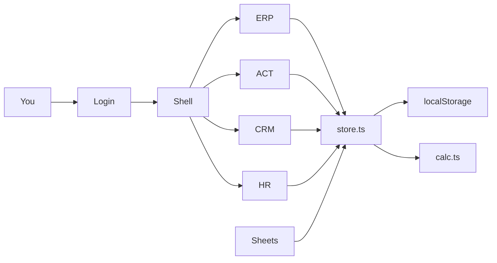

*สี่เสา หนึ่งสัน · Four stacks, one spine. Hand-drawn studio still; no HUD on the image.*

# EACH

**ERP + ACT + CRM + HR — one browser workspace for a small company.**

[](LICENSE)

[What this is](#what-this-is) · [Philosophy](#philosophy) · [Ethical use](#ethical-use) · [How to use / learn](#how-to-use--learn) · [System diagram](#system-diagram) · [License](#license--contributing)

By [Non Arkaraprasertkul](https://github.com/Nonarkara) (Nonarkara) — [Axiom X Co., Ltd.](https://github.com/Nonarkara/Axiom), Bangkok.

Independent civic-studio software. Written for a **Thai–English** audience. **Not a billed SaaS, not a licensed accountant, and not an official Frappe / ERPNext product.**

เครื่องมือบริหารบริษัทเล็กสี่เสาในโค้ดเบสเดียว — การเงิน การลงบัญชี ลูกค้า และคน — ผู้อ่านเป้าหมายคือคนไทยและคนอังกฤษด้วยกัน

---

## What this is

EACH is a **Phase 0.5 Vite + React 19 + TypeScript** app that puts four founder jobs on one spine:

| Letter | Module | In this tree |
|--------|--------|----------------|
| **E** | **ERP** | Cash, burn, runway, CapEx vs OpEx, OKRs — `src/modules/erp/` |
| **A** | **ACT** | Expense ledger, action queue — `src/modules/act/` |
| **C** | **CRM** | Project / deal kanban — `src/modules/crm/` |
| **H** | **HR** | Human roster + AI operators as cost lines — `src/modules/hr/` |

Persistence today is a **`localStorage` shim** (`src/lib/store.ts`). Finance arithmetic lives in `src/lib/calc.ts` (`calcFinance`): cash is founding capital plus received revenue minus expenses; monthly burn is human + AI + this month’s opex + loan installments; runway is `floor(cash / burn)`. The UI reads that function. It does not invent a second score.

Two curated tenants ship as **mock JSON**, plus a blank onboarding path:

- **Axiom X Co., Ltd.** — sign-in path (Google OAuth only when `VITE_GOOGLE_CLIENT_ID` is set locally) loads `src/data/axiom-mock.ts`
- **ABC Company Limited** — “Try demo” loads `src/data/abc-mock.ts` (fictitious distressed case study)
- **Start blank** — three-step onboarding in `src/modules/onboarding/`

Google Sheets is the optional **engine room**: CSV templates under `docs/sheets/`, Apps Script in `sheets/apps-script.gs`, and a two-way bridge in `src/services/sheets.ts` once you paste your own Web App URL. Founder walkthrough: [`docs/MANUAL.md`](docs/MANUAL.md).

**What is planned, not shipped in this tree**

- **Phase 2 Frappe** — `src/services/api.ts` is a documented swap point (`frappeClient`). There is no ERPNext / Frappe HR / Frappe CRM backend in this repository.
- **Phase 1 live APIs** — company lookup, Gmail import, and OCR are stubs (`src/services/companyLookup.ts`, `gmail.ts`, `ocr.ts`) unless you point env vars at *your* endpoints.
- GitHub OAuth appears in `.env.example` as a placeholder. The running login gate is **Google (optional) + demo + blank**.

A GitHub Pages workflow (`.github/workflows/deploy.yml`) builds `dist/` on push to `main`. `public/CNAME` names `each.nonarkara.org`. Treat any public host as a **studio static build**, not a production ERP.

**This repo is not**

- A licensed accounting, payroll, or tax product
- A ranking of companies, founders, or AI tools
- A live Frappe site, a billed Axiom product, or an official depa / municipal system
- API keys, `.env` files, or anyone else’s books

Related public work: [Ikigai Finance Engine](https://github.com/Nonarkara/ikigai-finance-engine) (research notes), [ikigai-finance](https://github.com/Nonarkara/ikigai-finance) (single-company cockpit). EACH is the four-module studio app; those siblings are not this tree.

---

## Philosophy

Studio tenets, applied to a founder desk:

**Fork the method, not the secrets.** Take the four-module spine, the conservation laws in `calcFinance`, the Sheets-as-engine-room pattern, and the rule that mock tenants stay labelled mock. Leave OAuth client secrets, Apps Script Web App URLs, Frappe cookies, and real ledgers on *your* machine. They do not belong in issues, screenshots, or pull requests.

**One Mac.** This app is meant to run in a browser on the computer in front of you — `npm run dev`, localStorage, optional Sheets. You do not need a cluster, a staging fleet, or a vendor ERP to learn the method. Phase 2 Frappe is a *swap of the data shim*, not a rewrite of the modules.

**No black-box rankings.** Runway is cash divided by monthly burn, floored. There is no unpublished composite score of companies, people, or “AI efficiency” that the README pretends is a ranking. HR stores an `efficiency` field on mock AI operators; that is fixture chrome, not a league table. If two stories disagree (cash vs burn vs pipeline), the cockpit is supposed to make the disagreement visible — not hide it behind a grade.

**Thai–English as the audience.** The studio writes for learners and operators who move between Thai and English. Currency in the mocks is THB. This README is English with a Thai lede and caption so a first glance is bilingual — not a claim that a fully localized product ships here.

Company: **Axiom X Co., Ltd.** Author: **Non Arkaraprasertkul** (Nonarkara). Independent studio software, not a billed Axiom SKU and not an official depa, bank, or municipal system.

---

## Ethical use

Treat this as a **teaching cockpit**, not a substitute for an accountant, an auditor, or a payroll provider.

**Do**

- Run the ABC demo as a *fictitious* distress UI. Figures in `src/data/abc-mock.ts` are not a real company.
- Keep Axiom mock data mock. The sign-in tenant is a studio fixture for Axiom X Co., Ltd., not a public filing.
- Put credentials in a local `.env` (see `.env.example`). `.gitignore` already ignores `.env` and `.env.*`.
- Assume **unencrypted `localStorage`**. Salaries, tax IDs, and ledgers you type in the browser are plaintext on that machine. Do not put real PII here and call it production.
- Attribute the method when you fork the spine or the finance arithmetic.

**Do not**

- Present EACH as audited software, a credit rating, investment advice, or a government ERP.
- Ship mock data as live, or hide an empty Frappe URL behind a success state.
- Commit API keys, OAuth secrets, Apps Script URLs, Cloudflare tokens, or client books.
- Invent a live SaaS URL, an award, a user count, or a published ranking this tree does not contain.
- Imply Frappe, ERPNext, depa, or a bank publishes or certifies this app.
- Treat `efficiency` on AI operators, scenario-weighted pipeline, or runway months as a black-box score of people or firms.

If a contribution only works by pasting a secret or a real company’s books, it does not belong here.

---

## How to use / learn

Requires Node 20+ (CI uses Node 20). From the repo root:

```bash
npm install
npm run dev
```

Open the URL Vite prints (default `http://localhost:5173`).

| Path | What you get |
|------|----------------|
| **Try demo — ABC Company** | Fictitious failing-startup fixture; CSV bundle download |
| **Start blank** | Onboarding → empty store |
| **Sign in with Google** | Only if you set `VITE_GOOGLE_CLIENT_ID`; loads the Axiom mock |

Then:

1. Read [`docs/MANUAL.md`](docs/MANUAL.md) — Sheets-first setup, formulas, troubleshooting.
2. Optional Sheets: paste `sheets/apps-script.gs` into a Google Sheet, deploy a Web App, paste the URL in the in-app Sheets settings. Schema: [`docs/sheets/tab-schema.json`](docs/sheets/tab-schema.json).
3. Read `src/lib/calc.ts` — the conservation laws are short on purpose.
4. Production build: `npm run build` then `npm run preview`. Lint: `npm run lint`.

Env placeholders (empty in git): [`.env.example`](.env.example). Never commit a filled `.env`.

---

## System diagram

Short labels so GitHub’s renderer does not clip.



UI modules talk to `storeApi` / `useStore()` only. Phase 2 is meant to replace that shim with `frappeClient` in `src/services/api.ts` — that backend is **not** in this tree.

```
src/
  components/     Shell, Hero, Sheets modal
  lib/            types, store shim, calcFinance, auth
  modules/        erp, act, crm, hr, onboarding, dossier, auth
  services/       sheets, Frappe stub, lookup/gmail/ocr stubs
  data/           axiom-mock, abc-mock
```

---

## License / contributing

[MIT](LICENSE). Copyright © 2026 **Non Arkaraprasertkul / Axiom X Co., Ltd.**

MIT covers this repository’s source, docs, and illustration. It does not relicense Frappe / ERPNext, Google APIs, or any private ledger that is not in this tree. The hero at `docs/hero-banner.jpg` is studio illustration for this README — not a screenshot and not a data product.

Useful contributions: clearer prose, a Thai README pass that stays faithful to these English notes, accessibility fixes, and mermaid that still fits GitHub. Open a pull request against `main`. Do not add secrets, real PII, invented metrics, fake live URLs, or a stub that pretends Frappe is already live.

If you build your own four-module spine from this method, the studio would like to see it.
