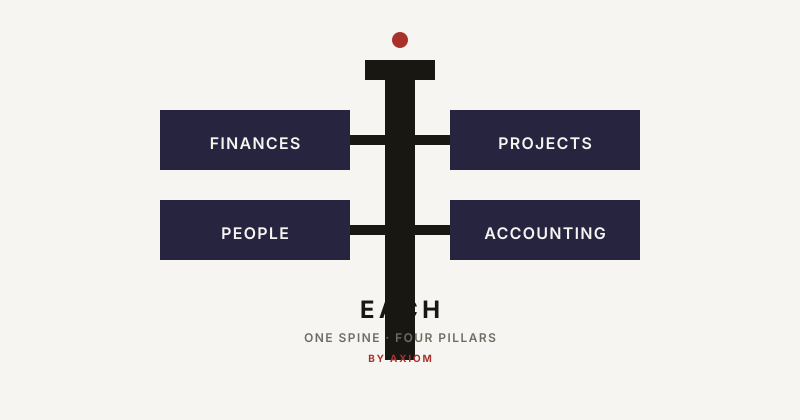
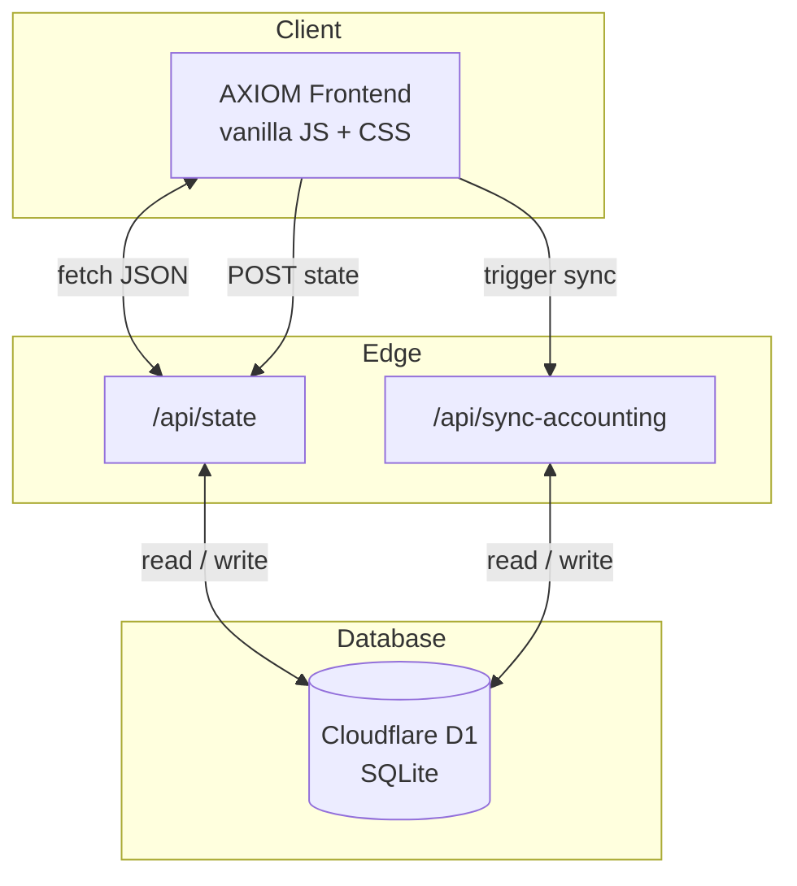

# AXIOM

> **CRM + ERP + HR + Accounting for the startup.**  
> One spine. Four pillars. Nothing else.

[](https://each.nonarkara.org)
[](#architecture)
[](#files)
[](#license)

<p align="center">
  
</p>

---

## Why AXIOM

Most business software is a frankenstein of foreign runtimes, bloated modules, and features you will never use. Founders do not need a dashboard for dashboards. They need to know three things: **cash, people, and what is shipping**. Everything else is noise.

AXIOM strips it down:

- **One spine.** The cockpit, routing, and data layer are shared by every pillar.
- **Four pillars.** Finances, People, Projects, Accounting. No more, no less.
- **One bold move per surface.** Runway is the hero number. The rest is context.
- **No framework fatigue.** Vanilla JS and CSS. No build step in the way of reading the code.

If you are tired of stitching EspoCRM, ERPNext, Frappe HR, and a separate accounting app together, AXIOM is the opposite direction: a single, opinionated workspace that a solo founder can actually run.

---

## The four pillars

| Pillar | Discipline | What it gives you |
|---|---|---|
| **Finances** | ERP | Cash, burn, runway, CapEx/OpEx split, revenue pipeline, transparent ledger |
| **People** | HR | AI operators + human staff, both treated as monthly OpEx |
| **Projects** | CRM | Kanban, checklists, notes, deal status, AI reads on outstanding revenue |
| **Accounting** | Books | Chart of accounts, double-entry journal, balance sheet, P&L |

The investor dossier is the fifth surface, but it is not a pillar — it is the **export**. One page, one print button.

---

## Architecture



- **Frontend:** Cloudflare Pages serves static HTML/CSS/JS.
- **Backend:** Cloudflare Pages Functions handle `/api/state` and `/api/sync-accounting`.
- **Database:** Cloudflare D1 stores one `workspace_state` row per workspace.
- **Offline fallback:** When served from `file://` or offline, the app falls back to browser `localStorage`.
- **Security:** Add Cloudflare Access on `each.nonarkara.org` for zero-code authentication, or set an `API_KEY` secret for token-level protection.

---

## Quick start

```bash
git clone https://github.com/Nonarkara/each.git
cd each
npm install
npm run dev          # http://localhost:8788
```

No bundler. No transpiler. The dev server is Wrangler with a local D1 binding.

**First-screen demo:** registration number **`0105566000000`** → AI autofills the company → scan the paperwork → founding capital lands → connect Gmail → receipts become expenses.

For day-to-day use, read [`MANUAL.md`](./MANUAL.md).

---

## Deploy your own

You need a Cloudflare account and a domain managed by Cloudflare.

### One-time setup

```bash
npx wrangler login
npm run db:migrate   # create the workspace_state table
npm run deploy       # first deploy to Cloudflare Pages
```

Then in the Cloudflare dashboard:

1. Go to **Workers & Pages → each → Custom domains**.
2. Add `each.nonarkara.org` (or your own domain).
3. Optional: enable **Cloudflare Access** to gate the site.

### Continuous deployment

A GitHub Actions workflow is included (`.github/workflows/deploy.yml`). It deploys on every push to `main` once you add two repository secrets:

- `CLOUDFLARE_API_TOKEN` — create one at **Cloudflare dashboard → My Profile → API Tokens** with `Cloudflare Pages:Edit` and `Zone:Read` permissions.
- `CLOUDFLARE_ACCOUNT_ID` — find it on the right sidebar of any Cloudflare dashboard page.

Add them under **Settings → Secrets and variables → Actions** in the GitHub repo.

### Optional API-key layer

```bash
npx wrangler pages secret put API_KEY
```

The frontend will prompt for the key if the server returns `401`.

---

## Design discipline

This repo follows the **AXIOM DNA**:

- One bold move per surface.
- Blue enclosed for identity; red bare for signal.
- Warm paper `#f6f5f2`, square corners, hairline cell grids.
- Weight ceiling 600, tabular figures, small uppercase labels.
- No gradients, shadows, glows, rounded corners, or emoji.

The code follows the same rule: the smallest number of files and concepts that still works.

---

## Files

```
index.html                shell and script load order
css/axiom.css             AXIOM design system
js/data.js                persistence, seed data, simulated integrations
js/ui.js                  DOM helpers
js/sync.js                cloud sync indicator + remote state client
js/onboarding.js          company registration and setup flow
js/erp.js                 Finances pillar
js/hr.js                  People pillar
js/crm.js                 Projects pillar
js/accounting.js          Accounting pillar
js/app.js                 cockpit, routing, dossier, export/import
functions/api/state.js    GET/POST workspace state
functions/api/sync-accounting.js   server-side accounting sync
functions/lib/accounting-sync.js   shared accounting logic
migrations/0001_init.sql  D1 schema
wrangler.toml             Cloudflare config
package.json              scripts and wrangler dependency
MANUAL.md                 human user guide
```

---

## Roadmap

- [x] Prototype with four working pillars
- [x] Cloudflare Pages + D1 backend
- [x] Custom domain + deploy pipeline
- [ ] Real AI company lookup
- [ ] Real Gmail OAuth + receipt ingestion
- [ ] Document OCR for registration paperwork
- [ ] Multi-workspace + user accounts
- [ ] Payroll, invoicing, tax export

---

## License

[MIT](./LICENSE)

> Beauty is what remains after everything that does not work is gone.
