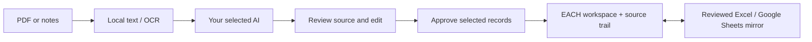

# EACH · Run your startup in one workspace

**Every piece of your startup, unified.**

> Cash, expenses, customer work and people. Connected records, reviewed inputs.

[Try EACH](https://each.nonarkara.org/) · [Founder manual](docs/MANUAL.md) ·
[AI & spreadsheet setup](docs/INTEGRATIONS.md) · [Self-host](docs/SELF_HOSTING.md)

**สำหรับสตาร์ทอัปและ SME:** ดูเงินสด บันทึกรายจ่าย ติดตามโครงการ และจัดการทีม
ในพื้นที่เดียว รองรับไทย/อังกฤษ ตรวจข้อเสนอ AI ก่อนบันทึก และรับส่งข้อมูลกับ
Excel หรือ Google Sheets ได้สองทาง


## From a document to a business record

Upload a PDF or paste notes. Use a local model or your own OpenAI-compatible
provider. EACH extracts text, shows proposed records beside source quotes, and
lets you edit and select what to approve. Approved expenses, capital, people and
deals go into their modules; Hippocampus keeps the approval trail and document
fingerprint. Scanned PDFs have optional local Thai/English OCR.


```mermaid
flowchart LR
  A[PDF or notes] --> B[Local text / OCR]
  B --> C[Your selected AI]
  C --> D[Review source and edit]
  D --> E[Approve selected records]
  E --> F[EACH workspace + source trail]
  F <--> G[Reviewed Excel / Google Sheets mirror]
```

| Capability | Available now | Setup / limit |
|---|---|---|
| Finance, accounting, CRM, people | Cash/burn/runway, expense ledger, actions, kanban, roster | Evaluation data or your local workspace |
| Thai / English | Language switch, script-aware type, explained workflows | Human Thai nuance review still pending |
| Reviewed document intake | Searchable PDF, pasted notes, optional local OCR; editable proposals | Your local model or provider; no writes before approval |
| Hippocampus | Approved source quotes, fingerprint, timestamp and record IDs | Source trail; keep original PDFs separately |
| Excel `.xlsx` | Export, edit, import, inspect additions/edits/deletions, approve | Explicit two-way file exchange |
| Cloud spreadsheets | Authenticated Google Sheets API / Microsoft Graph read/write connectors | Frappe and your provider configuration; live account test required |
| Google Apps Script | Explicit transfer, revision checks, read-back verification | Account-restricted deployment and browser access |
| Persistence | Browser cache plus optional Frappe/MariaDB workspace | Laptop profile requires production hardening |

**Release posture: pilot.** The public app lets you evaluate the workflows.
Configure and verify your backend, permissions, backups and cloud accounts before
using it for shared company operations. Native ERPNext/HR/CRM DocType integration
and full multi-user policy remain on the roadmap.

EACH rearranges four functions every founder juggles — **ERP**, **ACT**, **CRM**, and **HR** — into one word that is easy to spell, easy to pitch, and impossible to forget. No four logins. No tab chaos. One spine.

## The four modules

| Letter | Module | What it covers |
|--------|--------|----------------|
| **E** | **ERP** | Finance, inventory, operations — cash, burn, runway, CapEx vs OpEx |
| **A** | **ACT** | Accounting & actions — invoices, ledger, tax exports, the action queue |
| **C** | **CRM** | Customers, pipeline, deals — kanban, stages, touchpoints |
| **H** | **HR** | People, payroll, leave — humans + AI operators feeding OpEx |

## Why EACH works

Founders do not need another acronym deck. They need one surface where the runway number, the invoice queue, the deal pipeline, and the payroll line all reconcile. EACH is sticky naming: it is a product word, not a category label.

The architecture inherits honest lessons from the CRM2 / AXIOM prototype:

```
EACH DNA frontend   (look, flow, discipline — Josefin Sans + Source Sans 3, amber accent)
        ↓  REST / WebSocket
Frappe backend      (ERPNext + Frappe HR + Frappe CRM — phase 2)
```

**Frappe Books is a desktop app**, not a Frappe-framework app — it does not share the ERPNext backend. The clean integration play is the **Frappe ecosystem**: one framework, one auth, one data model.

## Clone and run locally

The frontend still works by itself for a quick evaluation:

```bash
git clone https://github.com/Nonarkara/each.git
cd each
npm install
npm run dev
```

Open the URL Vite prints (default `http://localhost:5173`).

For the complete self-hosted path with an open-source MariaDB database:

```bash
cp .env.example .env
npm run stack:up
npm run stack:logs
```

The first Frappe setup takes time. When it is ready, run `npm run dev` and use
EACH at `http://each.localhost:5173`. The development profile signs in to the
loopback-only Frappe API with the matching local credentials from `.env`.

**Full setup, backups, reset, and security notes:** [`docs/SELF_HOSTING.md`](docs/SELF_HOSTING.md)

## Human manual

New workflows: [Document intake and two-way mirrors](docs/INTEGRATIONS.md).

**Start here:** [`docs/MANUAL.md`](docs/MANUAL.md) — 15-minute Sheets-first setup, finance formulas, troubleshooting.

Google Sheets template: [`sheets/apps-script.gs`](sheets/apps-script.gs) + tab schema [`docs/sheets/tab-schema.json`](docs/sheets/tab-schema.json).

## Roadmap

| Phase | Scope |
|-------|--------|
| **0 — shipped** | Repo scaffold, landing, app shell, four-module routing, localStorage shim |
| **0.5** | Port CRM2 prototype logic (onboarding, ERP calc, HR roster, CRM kanban) into React modules |
| **1 — local backend** | Clone-and-run Frappe v15 + ERPNext + MariaDB stack, authenticated workspace persistence |
| **1.5 — reviewed intake** | Real PDF/text extraction, optional browser OCR, local/API AI proposals, source trail, Excel round trips and configured cloud mirror connectors |
| **2** | Frappe backend — swap data shim for ERPNext + Frappe HR + Frappe CRM REST |
| **3** | Multi-tenant role isolation, native payroll/invoicing/tax workflows, managed provider OAuth and production operations |

## Stack

- **Vite** + **React 19** + **TypeScript** (strict)
- **Tailwind CSS v4** with Dr Non design tokens
- **Typography:** Josefin Sans (display) · Source Sans 3 (body) · JetBrains Mono (data)
- **Persistence:** `localStorage` offline cache, with optional Frappe v15 + MariaDB sync
- **Deployment:** GitHub Pages for evaluation; self-hosted Frappe/MariaDB for authenticated persistence

## Security notice

As a Phase 0.5 static client application, EACH currently employs two architectural trade-offs that must be understood before storing real business data:
1. **Unencrypted Local Storage:** Sensitive PII (such as employee salaries and tax IDs) is persisted in plaintext within the browser's `localStorage`. Any malicious script running on the page (e.g., via a compromised dependency or browser extension) could read this data.
2. **Client-Side Authorization:** OAuth sign-in only authenticates identity client-side to gate mock data sets. There is currently no server-side enforcement of authorization limits.

The laptop stack adds authenticated Frappe/MariaDB persistence, but keeps
`localStorage` as an offline cache. It is a development profile, not a hardened
internet deployment; see [`docs/SELF_HOSTING.md`](docs/SELF_HOSTING.md) before
using real business data.

## Project layout

```
src/
  components/     Shell, Hero, module cards
  lib/            types, store shim
  modules/        erp/, act/, crm/, hr/ (phase 0.5)
backend/           EACH Frappe persistence app
docker/            reproducible laptop bootstrap
docker-compose.yml Frappe + MariaDB + Redis local stack
context.md        live metadata
CLAUDE.md         build rules + anti-regression
tasks/            todo + lessons
```

## Development and verification

```bash
npm test
npm run lint
npm run build
python3 -m unittest discover -s backend/each_backend/tests -v
```

[Contribution guide](CONTRIBUTING.md) · [Security policy](SECURITY.md).
Tests cover money calculations, atomic document approvals, invented evidence,
duplicate intake, XLSX round trips, formula rejection and stale review conflicts.
Cloud credentials are never part of the test fixtures.

## Lineage

EACH supersedes the CRM2 workspace prototype (`/Users/nonarkara/Projects/CRM2`), which shipped as **AXIOM** with three pillars (Finances, People, Projects). EACH adds **ACT** as a first-class module and rebrands the product for founders who need one word, not one framework lecture.

---

Beauty is what remains after everything that does not work is gone.
# Touched 2026-07-03T05:56:54Z — checking deploy propagation
