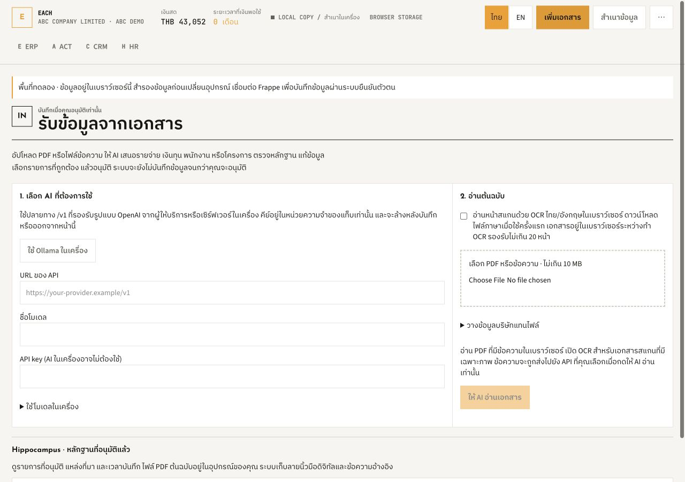
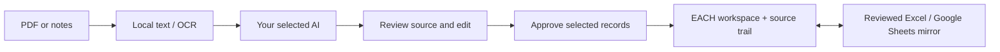
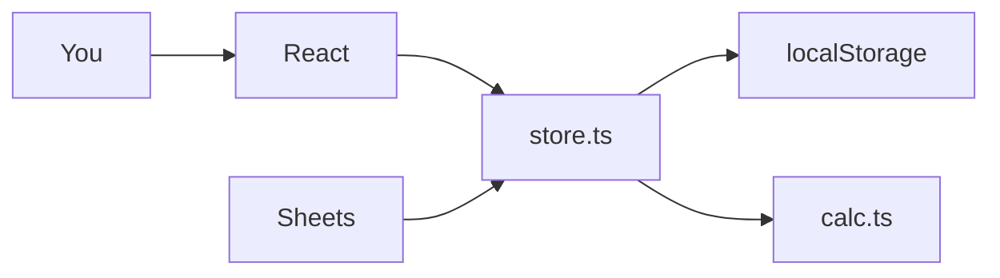

*สี่เสา หนึ่งสัน · Four stacks, one spine. Hand-drawn studio still; no HUD on the image.*

# EACH · Run your startup in one workspace

**Every piece of your startup, unified.**

> Cash, expenses, customer work and people. Connected records, reviewed inputs.

[Try EACH](https://each.nonarkara.org/) · [Founder manual](docs/MANUAL.md) ·
[AI & spreadsheet setup](docs/INTEGRATIONS.md) · [Adapted patterns & security](docs/PRIOR_ART.md) · [Self-host](docs/SELF_HOSTING.md)

**สำหรับสตาร์ทอัปและ SME:** ดูเงินสด บันทึกรายจ่าย ติดตามโครงการ และจัดการทีม
ในพื้นที่เดียว รองรับไทย/อังกฤษ ตรวจข้อเสนอ AI ก่อนบันทึก และรับส่งข้อมูลกับ
Excel หรือ Google Sheets ได้สองทาง



## From a document to a business record

Upload a PDF or paste notes. Use a local model or your own OpenAI-compatible
provider. EACH extracts text, shows proposed records beside source quotes, and
lets you edit and select what to approve. Approved expenses, capital, people and
deals go into their modules; Hippocampus keeps the approval trail and document
fingerprint. Scanned PDFs have optional local Thai/English OCR.


```mermaid
flowchart LR
  A[PDF or notes] --> B[Local text / OCR]
  B --> C[Your selected AI]
  C --> D[Review source and edit]
  D --> E[Approve selected records]
  E --> F[EACH workspace + source trail]
  F <--> G[Reviewed Excel / Google Sheets mirror]
```

| Capability | Available now | Setup / limit |
|---|---|---|
| Finance, accounting, CRM, people | Cash/burn/runway, expense ledger, actions, kanban, roster | Evaluation data or your local workspace |
| Thai / English | Language switch, script-aware type, explained workflows | Human Thai nuance review still pending |
| Reviewed document intake | Searchable PDF, pasted notes, optional local OCR; editable proposals | Your local model or provider; no writes before approval |
| Security Center | Observed controls, encrypted backup/restore, metadata activity, incident guidance | Backend checks require upgraded authenticated Frappe; browser cache remains plaintext |
| Quick navigation | Thai/English tool search with Cmd/Ctrl+K | Find ERP, ACT, CRM, HR, documents, mirrors and security |
| Hippocampus | Approved source quotes, fingerprint, timestamp and record IDs | Source trail; keep original PDFs separately |
| Excel `.xlsx` | Export, edit, import, inspect additions/edits/deletions, approve | Explicit two-way file exchange |
| Cloud spreadsheets | Authenticated Google Sheets API / Microsoft Graph read/write connectors | Frappe and your provider configuration; live account test required |
| Google Apps Script | Explicit transfer, revision checks, read-back verification | Account-restricted deployment and browser access |
| Persistence | Browser cache plus optional Frappe/MariaDB workspace | Laptop profile requires production hardening |

**Release posture: pilot.** The public app lets you evaluate the workflows.
Configure and verify your backend, permissions, backups and cloud accounts before
using it for shared company operations. Native ERPNext/HR/CRM DocType integration
and full multi-user policy remain on the roadmap.

EACH rearranges four functions every founder juggles — **ERP**, **ACT**, **CRM**, and **HR** — into one word that is easy to spell, easy to pitch, and impossible to forget. No four logins. No tab chaos. One spine.

## The four modules

| Letter | Module | What it covers |
|--------|--------|----------------|
| **E** | **ERP** | Finance, inventory, operations — cash, burn, runway, CapEx vs OpEx |
| **A** | **ACT** | Accounting & actions — invoices, ledger, tax exports, the action queue |
| **C** | **CRM** | Customers, pipeline, deals — kanban, stages, touchpoints |
| **H** | **HR** | People, payroll, leave — humans + AI operators feeding OpEx |

## Why EACH works

Founders do not need another acronym deck. They need one surface where the runway number, the invoice queue, the deal pipeline, and the payroll line all reconcile. EACH is sticky naming: it is a product word, not a category label.

The architecture inherits honest lessons from the CRM2 / AXIOM prototype:

```
EACH DNA frontend   (look, flow, discipline — Josefin Sans + Source Sans 3, amber accent)
        ↓  REST / WebSocket
Frappe backend      (ERPNext + Frappe HR + Frappe CRM — phase 2)
```

**Frappe Books is a desktop app**, not a Frappe-framework app — it does not share the ERPNext backend. The clean integration play is the **Frappe ecosystem**: one framework, one auth, one data model.

## Clone and run locally

The frontend still works by itself for a quick evaluation:

```bash
git clone https://github.com/Nonarkara/each.git
cd each
npm install
npm start
```

The browser opens the **ABC sample workspace** at `http://127.0.0.1:5173/?workspace=demo`. No `.env`, Docker, or OAuth. Reset from the shell returns you to the door.

Do **not** copy `.env.example` unless you want the optional Frappe stack — a filled `VITE_FRAPPE_URL` looks for Docker.

For the complete self-hosted path with an open-source MariaDB database:

```bash
cp .env.example .env
# Uncomment VITE_FRAPPE_URL=http://each.localhost:8000 in .env
npm run stack:up
npm run stack:logs
```

The first Frappe setup takes time. When it is ready, run `npm run dev` and use
EACH at `http://each.localhost:5173`. The development profile signs in to the
loopback-only Frappe API with the matching local credentials from `.env`.

**Full setup, backups, reset, and security notes:** [`docs/SELF_HOSTING.md`](docs/SELF_HOSTING.md)

## Human manual

New workflows: [Document intake and two-way mirrors](docs/INTEGRATIONS.md).

**Start here:** [`docs/MANUAL.md`](docs/MANUAL.md) — 15-minute Sheets-first setup, finance formulas, troubleshooting.

Google Sheets template: [`sheets/apps-script.gs`](sheets/apps-script.gs) + tab schema [`docs/sheets/tab-schema.json`](docs/sheets/tab-schema.json).

## Roadmap

| Phase | Scope |
|-------|--------|
| **0 — shipped** | Repo scaffold, landing, app shell, four-module routing, localStorage shim |
| **0.5** | Port CRM2 prototype logic (onboarding, ERP calc, HR roster, CRM kanban) into React modules |
| **1 — local backend** | Clone-and-run Frappe v15 + ERPNext + MariaDB stack, authenticated workspace persistence |
| **1.5 — reviewed intake** | Real PDF/text extraction, optional browser OCR, local/API AI proposals, source trail, Excel round trips and configured cloud mirror connectors |
| **2** | Frappe backend — swap data shim for ERPNext + Frappe HR + Frappe CRM REST |
| **3** | Multi-tenant role isolation, native payroll/invoicing/tax workflows, managed provider OAuth and production operations |

## Stack

- **Vite** + **React 19** + **TypeScript** (strict)
- **Tailwind CSS v4** with Dr Non design tokens
- **Typography:** Josefin Sans (display) · Source Sans 3 (body) · JetBrains Mono (data)
- **Persistence:** `localStorage` offline cache, with optional Frappe v15 + MariaDB sync
- **Deployment:** GitHub Pages for evaluation; self-hosted Frappe/MariaDB for authenticated persistence

## Security notice

As a Phase 0.5 static client application, EACH currently employs two architectural trade-offs that must be understood before storing real business data:
1. **Unencrypted Local Storage:** Sensitive PII (such as employee salaries and tax IDs) is persisted in plaintext within the browser's `localStorage`. Any malicious script running on the page (e.g., via a compromised dependency or browser extension) could read this data.
2. **Client-Side Authorization:** OAuth sign-in only authenticates identity client-side to gate mock data sets. There is currently no server-side enforcement of authorization limits.

The laptop stack adds authenticated Frappe/MariaDB persistence, but keeps
`localStorage` as an offline cache. It is a development profile, not a hardened
internet deployment; see [`docs/SELF_HOSTING.md`](docs/SELF_HOSTING.md) before
using real business data.

## Project layout

```
src/
  components/     Shell, Hero, module cards
  lib/            types, store shim
  modules/        erp/, act/, crm/, hr/ (phase 0.5)
backend/           EACH Frappe persistence app
docker/            reproducible laptop bootstrap
docker-compose.yml Frappe + MariaDB + Redis local stack
context.md        live metadata
CLAUDE.md         build rules + anti-regression
tasks/            todo + lessons
```

## Development and verification

```bash
npm test
npm run lint
npm run build
python3 -m unittest discover -s backend/each_backend/tests -v
```

[Contribution guide](CONTRIBUTING.md) · [Security policy](SECURITY.md).
Tests cover money calculations, atomic document approvals, invented evidence,
duplicate intake, XLSX round trips, formula rejection and stale review conflicts.
Cloud credentials are never part of the test fixtures.

## Lineage

EACH supersedes the CRM2 workspace prototype (`/Users/nonarkara/Projects/CRM2`), which shipped as **AXIOM** with three pillars (Finances, People, Projects). EACH adds **ACT** as a first-class module and rebrands the product for founders who need one word, not one framework lecture.

---

Beauty is what remains after everything that does not work is gone.
# Touched 2026-07-03T05:56:54Z — checking deploy propagation

---

## Philosophy

Studio tenets, applied to a founder desk:

**Fork the method, not the secrets.** Take the four-module spine, the conservation laws in `calcFinance`, the Sheets-as-engine-room pattern, and the rule that mock tenants stay labelled mock. Leave OAuth client secrets, Apps Script Web App URLs, Frappe cookies, and real ledgers on *your* machine. They do not belong in issues, screenshots, or pull requests.

**One Mac.** This app is meant to run in a browser on the computer in front of you — `npm run dev`, localStorage, optional Sheets. You do not need a cluster, a staging fleet, or a vendor ERP to learn the method. Phase 2 Frappe is a *swap of the data shim*, not a rewrite of the modules.

**No black-box rankings.** Runway is cash divided by monthly burn, floored. There is no unpublished composite score of companies, people, or “AI efficiency” that the README pretends is a ranking. HR stores an `efficiency` field on mock AI operators; that is fixture chrome, not a league table. If two stories disagree (cash vs burn vs pipeline), the cockpit is supposed to make the disagreement visible — not hide it behind a grade.

**Thai–English as the audience.** The studio writes for learners and operators who move between Thai and English. Currency in the mocks is THB. This README is English with a Thai lede and caption so a first glance is bilingual — the app now has a Thai/English language switch and workflow guidance; human language review remains pending.

Company: **Axiom X Co., Ltd.** Author: **Non Arkaraprasertkul** (Nonarkara). Independent studio software, not a billed Axiom SKU and not an official depa, bank, or municipal system.

---

## Ethical use

Treat this as a **teaching cockpit**, not a substitute for an accountant, an auditor, or a payroll provider.

**Do**

- Run the ABC demo as a *fictitious* distress UI. Figures in `src/data/abc-mock.ts` are not a real company.
- Keep Axiom mock data mock. The sign-in tenant is a studio fixture for Axiom X Co., Ltd., not a public filing.
- Put credentials in a local `.env` (see `.env.example`). `.gitignore` already ignores `.env` and `.env.*`.
- Assume **unencrypted `localStorage`**. Salaries, tax IDs, and ledgers you type in the browser are plaintext on that machine. Do not put real PII here and call it production.
- Attribute the method when you fork the spine or the finance arithmetic.

**Do not**

- Present EACH as audited software, a credit rating, investment advice, or a government ERP.
- Ship mock data as live, or hide an empty Frappe URL behind a success state.
- Commit API keys, OAuth secrets, Apps Script URLs, Cloudflare tokens, or client books.
- Invent a live SaaS URL, an award, a user count, or a published ranking this tree does not contain.
- Imply Frappe, ERPNext, depa, or a bank publishes or certifies this app.
- Treat `efficiency` on AI operators, scenario-weighted pipeline, or runway months as a black-box score of people or firms.

If a contribution only works by pasting a secret or a real company’s books, it does not belong here.

---

## How to use / learn

Requires Node 22.13+ (CI uses Node 22). From the repo root:

```bash
npm install
npm start
```

`npm start` opens `/?workspace=demo` (ABC fixture). `npm run dev` starts the same server without forcing a tab.

| Path | What you get |
|------|----------------|
| **Explore sample workspace** | Fictitious ABC fixture — also `/?workspace=demo` |
| **Set up my company** | Onboarding → empty store — also `/?workspace=blank` |
| **Company / database sign-in** | Only if you configured Google + Frappe; loads the labelled Axiom fixture |

Then:

1. Read [`docs/MANUAL.md`](docs/MANUAL.md) — setup, formulas, troubleshooting; pair it with the new integration guide.
2. Optional Sheets: paste `sheets/apps-script.gs` into a Google Sheet, deploy a Web App, paste the URL in the in-app Sheets settings. Schema: [`docs/sheets/tab-schema.json`](docs/sheets/tab-schema.json).
3. Read `src/lib/calc.ts` — the conservation laws are short on purpose.
4. Production build: `npm run build` then `npm run preview`. Lint: `npm run lint`.

Env placeholders (empty in git): [`.env.example`](.env.example). Never commit a filled `.env`.

---

## System diagram

Short labels so GitHub’s renderer does not clip.


```mermaid
flowchart LR
  You[You] --> UI[React]
  UI --> S[store.ts]
  S --> LS[localStorage]
  Sheet[Sheets] --> S
  S --> F[calc.ts]
```

React modules **ERP · ACT · CRM · HR** all call `storeApi`. Sheets is optional.

UI modules talk to `storeApi` / `useStore()` only. Phase 2 is meant to replace that shim with `frappeClient` in `src/services/api.ts` — the repository now includes an authenticated Frappe workspace app. Native ecosystem DocType mapping remains pending.

```
src/
  components/     Shell, Hero, Sheets modal
  lib/            types, store shim, calcFinance, auth
  modules/        erp, act, crm, hr, onboarding, dossier, auth
  services/       mirrors, AI intake, Frappe sync, legacy lookup/gmail stubs
  data/           axiom-mock, abc-mock
```

---

## License / contributing

[MIT](LICENSE). Copyright © 2026 **Non Arkaraprasertkul / Axiom X Co., Ltd.**

MIT covers this repository’s source, docs, and illustration. It does not relicense Frappe / ERPNext, Google APIs, or any private ledger that is not in this tree. The hero at `docs/hero-banner.jpg` is studio illustration for this README — not a screenshot and not a data product.

Useful contributions: clearer prose, a Thai README pass that stays faithful to these English notes, accessibility fixes, and mermaid that still fits GitHub. Open a pull request against `main`. Do not add secrets, real PII, invented metrics, fake live URLs, or a stub that pretends Frappe is already live.

If you build your own four-module spine from this method, the studio would like to see it.
